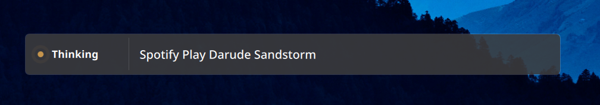
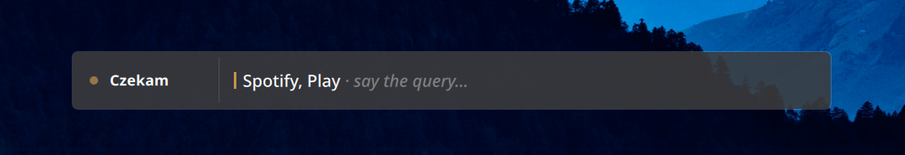

<p align="center">
  
</p>

<h1 align="center">Korder</h1>

<p align="center">
  Voice transcription + voice-controlled actions for KDE Plasma (Wayland).<br>
  Push a hotkey, dictate Polish or English, and have your speech either typed<br>
  into the focused app or interpreted as commands (media control, Spotify,<br>
  keyboard shortcuts) routed through a small local Gemma model.
</p>

<p align="center">
  
  <br><em>Listening — your spoken command, with locked-prefix highlighting</em>
</p>

<p align="center">
  
  <br><em>Thinking — Gemma parses the command into structured ops</em>
</p>

<p align="center">
  
  <br><em>Executing — action narrates its progress in the Plasma accent color</em>
</p>

<p align="center">
  
  <br><em>Done — action finished, committed text echoed back</em>
</p>

<p align="center">
  
  <br><em>Awaiting — pending parameter (alt path when an action needs more input)</em>
</p>

<p align="center" width="100%">
  <video src="https://github.com/user-attachments/assets/1553b06a-2d5d-4912-96bf-b685b0691098" width="80%" controls></video>
  <br><em>End-to-end Spotify command — Listening → Thinking → Executing (with action narration) → Done</em>
</p>

Built for one user — me — on KDE Plasma 6 / Wayland. Nothing here is
production-grade, but everything works on a quiet desk mic with a 7800 XT.

## Features

- **Live transcription** via [whisper.cpp](https://github.com/ggerganov/whisper.cpp) with the Vulkan backend (GPU-accelerated on AMD/Nvidia/Intel)
- **Pill-shaped layer-shell OSD** (org.kde.layershell) — overlay never steals focus, stays above all windows. Anchored to the bottom of the screen, semi-transparent so KWin's Blur effect picks it up automatically. Three sections:
    - leading: animated accent dot + state label (*Listening → [Loading] → Thinking → Executing → Done*; the app shows the same labels translated when the system locale is Polish). The bracketed *Loading* state appears only on the cold-start path — when ollama needs to page the LLM into VRAM because `keep_alive_s` had expired — so the user knows the extra wait is mechanical loading, not semantic reasoning. Color-coded distinctly (soft-blue) from the amber Thinking pulse.
    - center: your transcription, with **locked-prefix highlighting** — the longest word-aligned common prefix between successive Whisper partials renders bright while the still-revising tail fades, so the eye knows what's settled. Action progress narration (*"Searching Spotify for Linkin Park… → Found album: Linkin Park → Playing Linkin Park"*) renders inline in your Plasma accent color, italic, distinct from your spoken command.
    - "Press ESC to cancel" hint below the pill while listening.
- **System tray app** with global hotkeys (KGlobalAccel via the IPC `korder toggle` and `korder cancel` commands) and a Settings… dialog covering every config key — no hand-editing required
- **Write mode toggle** — say *"start writing"* to start typing into the focused app, *"stop writing"* to stop. Default is preview-only.
- **Action vocabulary** dispatched via either a regex parser or a local LLM (Gemma via ollama):
    - Keys: Enter, Tab, Escape, Backspace
    - Shortcuts: Ctrl+Backspace (delete word), Ctrl+A (select all), Ctrl+Z (undo), Shift+Home/End (select line)
    - Media playback: play/pause, stop, next/previous track (via kernel media keycodes — KDE routes them to whichever MPRIS player is active)
    - System volume: up/down/mute via `wpctl` directly (kernel keycodes raced with the auto-duck through KDE's separate volume cache and lost increments). Supports magnitude qualifiers — *"much louder"* steps 20%, *"a bit quieter"* steps 2%, *"louder by 20%"* takes the explicit number. Default step is 5%.
    - Now playing: ask *"what's playing"* / *"co teraz gra"* and Korder reads MPRIS metadata from the active player (Spotify, Firefox, mpv, …) and pops a desktop notification with track + artist. With the optional TTS extra enabled, also reads the answer aloud (Polish or English voice picked per-utterance).
    - Spotify: search and play albums, tracks, artists, or playlists via the Web API (free Client Credentials flow, no Premium required for search). When you don't say what kind ("Spotify play *Pink Floyd*"), one request fans out across all four types and the closest name match wins — artist > album > track > playlist within each match tier.
    - Web actions (xdg-routed, opens default browser): web search (DuckDuckGo / Google / Bing / Startpage / Ecosia), YouTube search, Wikipedia (auto-picks language from system locale), Maps
    - System: lock screen via `xdg-screensaver lock`; shutdown / reboot / sleep via `systemctl` (each gated behind voice confirmation — saying just *"shutdown computer"* doesn't fire it, you have to say *"yes"* / *"tak"* to a follow-up question)
    - End-by-voice: *"cancel that"* / *"nevermind"* / *"forget it"* / *"nieważne"* aborts mid-recording, and graceful-end phrasings like *"that's all"* / *"we're done"* / *"koniec"* / *"zakończ"* / *"to wszystko"* / *"stop listening"* close the session the same way — pending text and queued actions in the utterance go nowhere either way
- **Pending parameter handling with LLM-generated prompts** — say *"Spotify play"* and Gemma both detects the action AND emits a contextual question in the same JSON response: *"Co chcesz odtworzyć w Spotify?"* in Polish, *"What do you want to play on Spotify?"* in English. The follow-up utterance becomes the search query. Same pattern works for confirmation (*"Czy uśpić komputer? Powiedz tak lub nie."*), web search (*"Co chcesz wyszukać w sieci?"*), and any future parameterized action — the LLM picks up the action's description + parameter name and phrases an appropriate ask in the input language. Falls back to hand-written i18n templates when the LLM is unavailable or the model omits the response field.
- **Conversational answers + follow-up memory** — ask a factual question Korder isn't expected to dispatch (*"Jaka jest stolica Francji?"*, *"ile to siedem razy osiem?"*) and Gemma answers directly in the OSD instead of opening a Wikipedia tab. The current dictation session keeps a rolling 4-turn history plus a structured `context` field — Gemma identifies the conversation's current subject ("Budapeszt", "Linkin Park") each turn and the next prompt surfaces it as a `Current topic:` line, so bare follow-ups bind to it cleanly. *"Co powiesz o Budapeszcie?"* → *"Ile ma mieszkańców?"* answers about Budapest's population, then *"A co powiesz o Warszawie?"* swaps the topic and *"A ile ono ma mieszkańców?"* answers about Warsaw. Same channel powers action-param inference: *"Co powiesz o zespole Linkin Park?"* → *"Czy możesz otworzyć ich w Spotify?"* fires `spotify_play(query="Linkin Park")` with no follow-up prompt. Small-talk works too (*"Czy lubisz kotki?"* → *"Tak, lubię kotki — są urocze."*). History + context both clear at session end (mic close, cancel, idle timeout) so cross-session topics never leak into a new *"hey jarvis"*. The model is told to say *"I don't know"* plainly rather than hallucinate when uncertain — it still occasionally gets facts wrong, but doesn't try to confidently invent them. Live-data questions (current time, today's weather) are intentionally not answered.
- **Graceful session end** — the cancel-by-voice path covers polite end signals as well as aborts. *"Ok, dzięki. Koniec."* / *"Zakończę."* / *"that's all"* / *"we're done"* / *"stop listening"* / *"to wszystko"* / *"wystarczy"* all close the session as cleanly as *"cancel that"* / *"nieważne"*. Same drop-everything semantics — pending text and queued actions in the same utterance go nowhere.
- **Multilingual intent** — regex mode ships hardcoded PL + EN trigger phrases for every action; LLM mode (Gemma) understands intent across any language it speaks (so Whisper can transcribe German/Spanish/French/etc. and the right action still fires)
- **Optional Gemma thinking step** — off by default. Slower (~1.9 s vs ~600 ms on E4B; ~3.9 s on E2B) and on the current 21-case benchmark it never improved accuracy, so it's kept as an opt-in for ambiguous phrasings the regex/prompt path doesn't cover. Toggle via `[intent] thinking_mode`. See *Picking your Gemma model* below for measured numbers.
- **Auto-stop after a command** — fires once an action lands so you don't have to hit the hotkey twice; pure dictation and mode toggles keep the session open
- **Opportunistic LLM preload** — when the hotkey opens the mic, Korder fires a fire-and-forget load request to ollama in parallel with your speech + Whisper. By the time the transcript is ready the model is usually resident, so the LLM call jumps straight to *Thinking* even when `keep_alive_s` had expired. Cold-load logging on stderr shows whether warm-up beat Whisper to the finish.
- **Auto-duck system volume while listening** (default on) — drops the default PipeWire sink to 30 % when the mic opens and restores the original level on stop, so speaker bleed stops confusing Whisper. Skipped if you're already quieter than the target; restored on crash via `atexit`. Volume commands ("louder", "quieter", "mute") restore the duck snapshot *before* the wpctl step lands, so an increment isn't silently overwritten by the post-action restore. Requires `wpctl`.
- **Wake-word activation** (off by default, opt-in via the **Wake word** Settings tab) — when enabled, the mic stays open and the configured phrase ("hey jarvis", "alexa", "hey mycroft", or "hey rhasspy" from openWakeWord's pretrained catalog) fires a dictation session as if you'd pressed the hotkey. Hotkey path keeps working alongside. Tray icon flips to a soft-blue waveform while wake-listening, warm accent while dictating; tooltip changes too so you always know whether the mic is open and why. Auto-cancels back to wake-listening on accidental wakes (configurable idle-timeout). Requires the optional dep — install with `uv sync --extra wake`. Detector runs on CPU via ONNX, ~5 % of one core when idle.
- **Spoken responses** (off by default, opt-in via the **Speech** Settings tab) — when enabled, conversational answers and `now_playing` results read aloud through a [Piper](https://github.com/OHF-Voice/piper1-gpl) voice. Polish + English defaults; per-utterance language switching driven by diacritic detection (so *"Stressed Out by Twenty One Pilots"* speaks in EN and *"Małomiasteczkowy"* speaks in PL even within the same session). While speaking, Korder pauses any active MPRIS player (Spotify, mpv, browser MPRIS bridges) for a clean dropout, then resumes. Requires the optional dep + voice models — install with `uv sync --extra tts` and pre-fetch voices (see Run section below). Real-time on CPU; per-utterance synthesis ~200–500 ms.

## OS dependencies

Tested on Arch Linux / CachyOS with KDE Plasma 6.6+. Other distros' package
names will differ but the binaries are the same.

### Required

```bash
# Input synthesis (Wayland-friendly)
sudo pacman -S ydotool wl-clipboard

# Audio decode (for the start-listening chime — soundfile binds to
# libsndfile; current libsndfile reads Opus). Pre-installed on most
# desktop distros; included for completeness.
sudo pacman -S libsndfile

# Build deps for whisper.cpp Vulkan backend (pywhispercpp builds from source)
sudo pacman -S cmake gcc vulkan-headers vulkan-icd-loader shaderc

# Local LLM serving for action parsing (optional — falls back to regex)
sudo pacman -S ollama

# Python package manager
sudo pacman -S uv
```

KDE Plasma 6 ships `org.kde.layershell` QML module, KSvg, and KWindowSystem
out of the box — no extra install if you're already on Plasma.

### Setup steps

```bash
# 1. ydotool needs /dev/uinput access. Run the script once:
./scripts/setup-uinput.sh
# Then log out + back in so the 'input' group membership applies.

# 2. Start the ydotoold daemon
systemctl --user enable --now ydotool

# 3. Start ollama (only if you want LLM action parsing)
sudo systemctl enable --now ollama
ollama pull gemma4:e4b   # default; gemma4:e2b is a smaller, lower-accuracy
                         # alternative — see "Picking your Gemma model" below

# 4. Sync Python deps
uv sync

# 5. Build pywhispercpp from source with Vulkan
CMAKE_ARGS="-DGGML_VULKAN=on" \
  uv pip install --force-reinstall --no-binary=pywhispercpp pywhispercpp
```

## Run

```bash
uv run korder
```

A waveform icon appears in your system tray. Left-click to toggle recording;
right-click for the context menu.

For a global hotkey, bind `/home/YOU/priv/korder/.venv/bin/korder toggle` in
**System Settings → Shortcuts → Custom Shortcuts → Edit → New → Global
Shortcut → Command/URL**. Common pick: `Ctrl+Space`.

To cancel a recording mid-flight without committing what you've said, bind
`/home/YOU/priv/korder/.venv/bin/korder cancel` to a second hotkey (the
OSD shows a "Press ESC to cancel" hint while listening — common pick is
`Esc`, though it has to go through KGlobalAccel since the OSD is a
focusless overlay).

For wake-word activation, install the extra and enable it in the Settings
dialog's **Wake word** tab:

```bash
uv sync --extra wake
```

The IPC accepts `wake-toggle`, `wake-on`, and `wake-off` if you want a
hotkey to flip wake-mode without opening the dialog (or you'd rather the
mic isn't listening 24/7 and only enable it on demand).

For spoken responses (e.g. *"co teraz gra"* read aloud through a
synthesized voice), install the TTS extra and enable it in the
Settings dialog's **Speech** tab:

```bash
uv sync --extra tts
# Pre-fetch voice models. --data-dir matters: Korder reads from
# ~/.local/share/piper, but the downloader defaults to CWD. Run via
# `uv run` so the project's venv (where piper-tts lives) is used.
mkdir -p ~/.local/share/piper
uv run python -m piper.download_voices \
  --data-dir ~/.local/share/piper \
  en_US-amy-medium pl_PL-darkman-medium
```

Korder uses [Piper](https://github.com/OHF-Voice/piper1-gpl) — neural
TTS that runs in real time on CPU. Polish + English voices are the
defaults; any voice from the [Piper voices catalogue](https://huggingface.co/rhasspy/piper-voices)
works, configured per-language in `[tts]`. Auto-detected per
utterance from text content. While speaking, Korder pauses any
playing MPRIS player (Spotify, mpv, browser MPRIS bridges) for a
clean dropout, then resumes; flip `suppress_when_playing = true` to
just stay silent during music instead. Today only `now_playing`
opts in to spoken output; future actions add a call to
`emit_progress_speak` to participate.

## Configuration

The tray menu's **Settings…** entry exposes every key in a tabbed dialog —
that's the recommended path. The underlying file is `~/.config/korderrc`,
auto-created on first run with reasonable defaults; edit by hand if you
prefer. Some interesting knobs:

```ini
[whisper]
model = medium          # tiny | base | small | medium | large-v3 | large-v3-turbo
language = pl           # whisper language hint; "pl"/"en"/etc. or empty for auto
n_threads = 4

[audio]
gain = 0.7                      # software gain on captured audio; lower if mic too hot
duck_during_recording = true    # lower system playback volume while listening
duck_volume_pct = 30            # target volume (% of full) while ducked; no-op if
                                # you're already quieter than this. Requires wpctl.
start_chime = true              # play a soft chime (src/korder/audio/chime.opus)
                                # when dictation starts. Mic capture is deferred
                                # ~400 ms until the chime's loud body finishes so
                                # Whisper doesn't transcribe it via speaker bleed.
                                # The tail plays during early recording at sub-bleed
                                # amplitude (combined with the ducker's drop, well
                                # below ASR threshold). Set false to skip.

[inject]
action_parser = regex   # "regex" (fast, deterministic) or "llm" (smarter, slower)
llm_model = gemma4:e4b  # ollama tag used when action_parser = llm. E4B is the
                        # measured default; E2B is faster but drops short Polish
                        # utterances. See "Picking your Gemma model" below.
paste_mode = auto       # auto | always | never — clipboard-paste vs direct type

# LLM intent-parser tuning (only applies when inject.action_parser = "llm").
[intent]
thinking_mode = false           # engage Gemma's reasoning loop before answering
show_triggers_in_prompt = false # include trigger phrases in the prompt catalog
timeout_s = 20                  # per-call timeout; generous so a slow think
                                # doesn't trip the regex fallback
keep_alive_s = 300              # how long ollama keeps the model in VRAM after
                                # a call. 0 unloads immediately (frees ~9.5 GB
                                # on E4B but pays ~3s cold-load next call).

[ui]
show_history_on_start = false
auto_stop_after_action = true   # stop recording once a command-style action
                                # fires (dictation/mode toggles keep going)

# Optional — Spotify Web API credentials. Without these, Spotify actions
# fall back to opening search results (user clicks). Get them at
# https://developer.spotify.com/dashboard (free, no Premium needed).
[spotify]
client_id =
client_secret =

# Engine for the "search the web for X" / "google X" / "wyszukaj X" voice
# action. Supported: duckduckgo (default), google, bing, startpage, ecosia.
# YouTube/Wikipedia/Maps actions don't read this — they go to their
# canonical URL.
[web]
search_engine = duckduckgo

# Optional — wake-word activation. Off by default. When enabled, the mic
# stays open and the configured phrase opens a dictation session as if
# the hotkey had fired. Requires `uv sync --extra wake`.
[wake]
enabled = false
engine = openwakeword             # only option today
phrase = hey_jarvis               # openwakeword catalog: hey_jarvis,
                                  # alexa, hey_mycroft, hey_rhasspy (or
                                  # your own model name if you trained
                                  # one — combo accepts arbitrary text)
sensitivity = 0.5                 # 0.0–1.0; lower = more triggers,
                                  # higher = fewer false positives
idle_timeout_s = 5                # cancel dictation back to wake-listening
                                  # if no speech arrives within this many
                                  # seconds (catches accidental wakes); 0
                                  # disables the auto-cancel

# Optional — spoken responses (issue #2). Off by default. When enabled,
# actions that produce a spoken response (now_playing today; future
# weather/time/date) plus conversational answers from Gemma read
# their result aloud through a Piper voice. Requires
# `uv sync --extra tts` and pre-fetched voice models — see the Run
# section above for the download command.
[tts]
enabled = false
engine = piper                    # only implemented backend today
voice_en = en_US-amy-medium       # any voice ID from the Piper voices
voice_pl = pl_PL-darkman-medium   # catalog (huggingface.co/rhasspy/piper-voices)
speed = 1.0                       # playback speed multiplier (Piper's
                                  # length_scale is the inverse, applied
                                  # internally; 0.5–2.0× clamp range)
suppress_when_playing = false     # true: stay silent when something is
                                  # already playing audio. false (default):
                                  # pause the active MPRIS player, speak,
                                  # resume — clean dropout, but the marquee
                                  # use case (now_playing) is precisely the
                                  # case where music IS playing, so default
                                  # off keeps the feature firing.
speak_action_progress = false     # voice every emit_progress_speak call,
                                  # not just speakable_response actions.
                                  # Off by default — keeps TTS scoped to
                                  # query answers rather than chatty
                                  # "Searching Spotify…" lines.
```

## Picking your Gemma model

Two ollama tags work out of the box. **E4B is the default and the
recommendation** unless you have a strong reason to pick otherwise.

|              | gemma4:e2b | gemma4:e4b |
|--------------|------------|------------|
| Effective params | 2.3 B  | 4.5 B      |
| GGUF on disk     | 7.2 GB | 9.6 GB     |

Measured on the 21-case headless `intent_bench` suite (AMD 7800 XT, ROCm,
ollama with flash attention, no warm-up):

| Config              | Pass rate     | Latency (avg / median) | Notes                              |
|---------------------|---------------|------------------------|------------------------------------|
| **E4B, thinking off** | **21/21 (100%)** | **631 / 630 ms**     | recommended default                |
| E2B, thinking off   | 17/21 (81%)   | 513 / 556 ms           | ~120 ms median win, drops 4 cases  |
| E4B, thinking on    | 20/21 (95%)   | 1,909 / 826 ms        | thinking buys nothing here, costs latency |
| E2B, thinking on    | 10/21 (48%)   | 3,872 / 3,911 ms      | thinking *hurts* the small model   |

Reproduce: `uv run python -m korder.intent_bench --model gemma4:e2b [--thinking] --json > out.json`. Raw JSON for all four runs lives under [`bench-results/`](bench-results/).

### What E2B specifically gets wrong

E2B drops short, oblique non-English phrasings that E4B handles
cleanly — synonym variants of play_pause that don't appear in the
prompt's hardcoded triggers, single-word write-mode toggles, and
Whisper-corrupted variants where a missing or duplicated character
defeats trigger-string matching but should still be recoverable
from intent. That's exactly the regime where E4B's extra parameters
carry their weight. English commands and explicit triggers in any
locale ("press enter", the Polish equivalents, etc.) work on both
models.

### Why thinking mode misbehaves on E2B

Counter-intuitive, but reproducible: enabling `[intent] thinking_mode = true`
on the small model collapses pass rate to 48% (vs 81% without thinking).
Small models under chain-of-thought tend to talk themselves out of the right
answer — capacity that should be classifying gets spent on a meandering
reasoning trace, and the final JSON often comes back empty. E4B has the
headroom to absorb the same prompt without regressing.

If you want thinking, use E4B. If you want speed and have the VRAM headroom,
use E4B with thinking off — it's both more accurate (100% vs 81%) and not
meaningfully slower than E2B at the median (630 ms vs 556 ms).

**Pick E2B only if** you're VRAM-constrained (~2.4 GB savings on disk and a
similar VRAM win) or running on a machine where every 100 ms of latency
matters more than getting Polish synonyms right.

## Voice commands (when LLM mode is on)

Say these in normal speech; phrasing variations work because Gemma
understands intent. Triggers in other locales exist for every command
(see `src/korder/actions/`), and the LLM parser extracts intent
across whichever language Whisper transcribes.

| Action            | Example phrasing                                 |
|-------------------|--------------------------------------------------|
| Press Enter       | "press enter", "submit"                           |
| Delete word       | "delete word"                                     |
| Select line       | "select line"                                     |
| Volume up/down    | "louder" / "quieter"                              |
| …with magnitude   | "much louder", "louder by 20%", "a bit quieter"   |
| Mute              | "mute audio", "toggle mute"                       |
| Play/pause        | "play music", "pause", "resume"                   |
| Stop playback     | "stop playback"                                   |
| Next/prev track   | "next song" / "previous song"                     |
| Now playing       | "what's playing", "what song is this"             |
| Spotify (any)     | "spotify play Pink Floyd"                         |
| Spotify album     | "spotify play album Meteora"                      |
| Spotify track     | "spotify play track Numb"                         |
| Spotify artist    | "spotify play artist Pink Floyd"                  |
| Spotify playlist  | "spotify play playlist workout"                   |
| Web search        | "search the web for X", "google X"                |
| YouTube           | "play X on YouTube"                               |
| Wikipedia         | "wikipedia X", "look up X on Wikipedia"           |
| Maps              | "navigate to X", "where is X"                     |
| Lock screen       | "lock screen"                                     |
| Shutdown          | "shutdown computer" (then "yes" to confirm)       |
| Reboot            | "restart computer" (then "yes" to confirm)        |
| Sleep             | "suspend computer" (then "yes" to confirm)        |
| Ask a question    | "what is the capital of France", "ile to 7×8"     |
| Small-talk        | "do you like cats", "how are you"                 |
| Follow-up         | (binds to current topic) "A ile ma mieszkańców?", "open it on Wikipedia", "play them on Spotify" |
| Write mode on     | "start writing"                                   |
| Write mode off    | "stop writing"                                    |
| End session       | "cancel that", "nevermind", "that's all", "koniec", "zakończ" |

## Development

```bash
uv run pytest                                    # 219 tests, no external services required
uv run pytest -m ollama                          # +44 integration tests against a live Gemma
uv run python -m korder.intent_bench             # 21-case headless benchmark vs the current model
uv run python -m korder.intent_bench --thinking  # …with Gemma's thinking step engaged
```

Adding a new action is one file in `src/korder/actions/`:

```python
from korder.actions.base import Action, register

register(Action(
    name="my_action",
    description="Short English description for the LLM prompt",
    triggers={
        "en": ["do the thing", "do that"],
        # Add other locales here for the regex parser; the LLM parser
        # works across whichever language Whisper transcribed.
    },
    op_factory=lambda _args: ("subprocess", ["my-cli", "--flag"]),
))
```

Then add the module to `src/korder/actions/__init__.py`'s import list. The
LLM prompt and regex parser pick it up automatically.

### Architecture notes

- [`docs/intent-architecture.md`](docs/intent-architecture.md) — why the
  intent parser uses JSON output rather than function calling, with
  measured numbers from a head-to-head against the `function-calling`
  branch.

## License

MIT — see [LICENSE](LICENSE).
